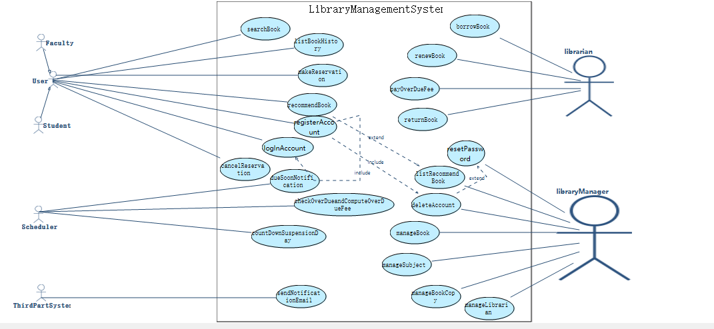

main中和master中都有请注意分支
## 1. 项目概述

本项目为图书馆管理系统原型，基于RM2PT需求工程工具开发，实现了用户账户管理、图书借阅、推荐系统等核心功能。


## 2. 建模结果

### 2.1 用例图




- 系统包含4类参与者（User(Faculty, Student),Scheduler, librarian,libraryManager）

- 核心用例覆盖账户全生命周期（注册/登录/密码重置/注销）和图书服务（推荐/预约）

- 采用include,extend关系复用基础验证逻辑（如密码校验）

  

  ## 3. 模型规模

  |   指标类型   |     数量      |                            备注                            |
  | :----------: | :-----------: | :--------------------------------------------------------: |
  | 自然语言需求 |     8+17      |                       符合INVEST原则                       |
  |    Actor     |       4       | User(Faculty, Student),Scheduler, librarian,libraryManager |
  |     用例     | 22（拓展6个） |                含6个核心用例（见下文扩展）                 |
  |  系统顺序图  |      12       |                   每个主用例对应1-2个SSD                   |
  |   系统操作   |      27       |                 平均每个SSD包含2.25个操作                  |
  |   系统合约   |      18       |                     前置/后置条件约束                      |
  |      类      |       9       |                    实体类+控制类+边界类                    |

**自然语言需求部分**

As a user, I want to interact with system, so that I can efficiently manage my tasks
{
Basic Flow {  
   (User) 1. The user shall log in using valid credentials.
   (User) 2. The user shall view their personalized dashboard upon login.
   (User) 3. The user shall search for relevant information using keywords.
   (System) 4. When a user initiates a search, the system shall return results ranked by relevance.
   (System) 5. When user selects a result, the system shall display detailed content.
   (User) 6. The user shall save items for future reference.
   (User) 7. The user shall share selected items via email or social media.
   (System) 8. When a user logs out, the system shall terminate session securely.
} 

Alternative Flow {  
   A. At any time,user enters incorrect login credentials :
      1.  The system display an error message and prompt user to try again.// 功能需求：用户交互流程控制
      2.  After three failed attempts system temporarily lock account and require email verification to unlock.

         // 非功能需求：安全策略（防止暴力破解

   B. At any time,system fails to retrieve data :  
      1. The system notify user of issue.
               // 功能需求：输入格式校验
      2. The system retry request up to three times before suggesting an alternative action.
               // 功能需求：业务流程阻断
} 
}
As a user, I want to register an account, so that I can access system securely
{
Alternative Flow {  
   A. At any time, user enters an invalid email format :  
      1. The system display an error message indicating incorrect format.
      // 功能需求：服务重试机制
      2. The system prevent registration until a valid email is provided.

         // 非功能需求：服务可靠性（邮件送达率）

} } 
As a user, I want to log in using my credentials, so that I can access my personalized content
{
Alternative Flow {  
   A. At any time, user enters incorrect login credentials :  

         1. The system display an error message and prompt user to try again.
             功能需求：用户交互流程控制（错误反馈机制）
            } }
            As a user, I want to reset my password, so that I can regain access to my account I forget my credentials
            {Alternative Flow {  
               A. At any time, user requests a password reset but does not receive email :  
                     1. The system provide an option to resend reset email.
                        // 功能需求：服务重试机制（操作流程设计）
                                 2. The email still does not arrive system suggest checking spam folder or contacting support.
                                    // 非功能需求：服务可靠性（邮件系统容错能力）
                                    } }
                                    As a user, I want to search for content, so that I can quickly find relevant information
                                    {Alternative Flow {  
                                       A. At any time, system fails to retrieve data :  
                                             1. The system notify user of issue.
                                                // 功能需求：异常状态通知
                                                         2. The system retry request up to three times before suggesting an alternative action.
                                                            // 非功能需求：系统容错能力
                                                            } }  
                                                            As a user, I want to bookmark frequently accessed items, so that I can easily find them later
                                                            {Alternative Flow {  
                                                               A. At any time, user attempts to bookmark an already saved item :  
                                                                     1. The system notify user that item is already bookmarked.
                                                                        // 功能需求：状态检测与反馈
                                                                        } } 
                                                                        As a user, I want to modify my profile information, so that I can keep my details up to date
                                                                        {Alternative Flow {  
                                                                           A. At any time, user enters invalid data updating profile :  
                                                                                 1. The system display an error message indicating which fields are incorrect.
                                                                                    // 功能需求：实时数据校验
                                                                                             2. The system prevent saving changes until errors are resolved.
                                                                                                // 功能需求：数据完整性保护
                                                                                                } }
                                                                                                As a user, I want to log out securely, so that I can prevent unauthorized access to my account
                                                                                                {Alternative Flow {  
                                                                                                   A. At any time, user tries to log out but session is already expired :  
                                                                                                         1. The system notify user that session has expired and log them out automatically.
                                                                                                            // 非功能需求：安全审计（自动终止无效会话）
                                                                                                            } } 
                                                                                                            As a user, I want to receive notifications for important updates, so that I can stay informed about system changes
                                                                                                            {Alternative Flow {  
                                                                                                               A. At any time, user does not receive a notification due to connectivity issues :  
                                                                                                                     1. The system retry sending notification once connectivity is restored.
                                                                                                                        // 功能需求：消息队列重发  
                                                                                                                        } } 

**核心用例清单**：

1. registerAccount

2. logInAccount

3. resetPassword

4. deleteAccount

5. recommendBook

6. makeReservation

   **系统顺序图**+系统操作

   

   

   


系统合约

<b>OP1 - searchBookByBarCode</b>

<table>
	<tr>
		<td><b>Operation Name:</b></td>
		<td><span name ="OPsearchBookByBarCode">searchBookByBarCode</span></td>
	</tr>
	<tr>
		<td><b>Operation ID:</b></td>
		<td>OP1</td>
	</tr>
	<tr>
		<td><b>Description:</b></td>
		<td> </td>
	</tr>
	<tr>
		<td><b>Service:</b></td>
		<td><a href="#SERVICESearchBook">SearchBook</a></td>
	</tr>
	<tr>
		<td><b>Input:</b></td>
<td><p>name: <i>barcode</i>, type: String</p></td>
</tr>
<tr>
	<td><b>Output Type:</b></td>
	<td>Set of Book</td>
</tr>
	<tr>
<td><b>Preconditions:</b></td>
		<td><p>The type of parameter <i>barcode</i> is equal to String</p></td>
</tr>
	<tr>
		<td><b>Postconditions:</b></td>
	<td><p>The return value was the set of class <a href="#CLASSBook">Book</a>, including all <i>book</i> in the instance set of class <a href="#CLASSBook">Book</a>. <i>book</i> represented an object of class <a href="#CLASSBook">Book</a>, and <i>book</i> meet:</p><p>&emsp;&emsp;At least one <i>c</i> existed in all objects which <i>book</i> was linked to by <i>Copys</i>. <i>c</i> represented an object of class <a href="#CLASSBookCopy">BookCopy</a>, and <i>c</i> meet:</p><p>&emsp;&emsp;&emsp;&emsp;The attribute <i>Barcode</i> of the object <i>c</i> was equal to <i>barcode</i></p></td>
	</tr>
</table>


<p>Contract of searchBookByBarCode:</p>

```java
Contract SearchBook::searchBookByBarCode(barcode:String): Set(Book) {
		/*
		 * Generated by RM2Doc - Precondition
		 * The type of parameter barcode is equal to String
		 */
		precondition:
			barcode.oclIsTypeOf(String)
		/*
		 * Generated by RM2Doc - Postcondition
		 * The return value was the set of class Book, including all book in the instance set of class Book. book represented an object of class Book, and book meet:
		 *     At least one c existed in all objects which book was linked to by Copys. c represented an object of class BookCopy, and c meet:
		 *         The attribute Barcode of the object c was equal to barcode
		 */
		postcondition:
			result = Book.allInstance()->select(book:Book | book.Copys->exists(c:BookCopy | c.Barcode = barcode))
}
```

<b>OP2 - searchBookByTitle</b>

<table>
	<tr>
		<td><b>Operation Name:</b></td>
		<td><span name ="OPsearchBookByTitle">searchBookByTitle</span></td>
	</tr>
	<tr>
		<td><b>Operation ID:</b></td>
		<td>OP2</td>
	</tr>
	<tr>
		<td><b>Description:</b></td>
		<td> </td>
	</tr>
	<tr>
		<td><b>Service:</b></td>
		<td><a href="#SERVICESearchBook">SearchBook</a></td>
	</tr>
	<tr>
		<td><b>Input:</b></td>
<td><p>name: <i>title</i>, type: String</p></td>
</tr>
<tr>
	<td><b>Output Type:</b></td>
	<td>Set of Book</td>
</tr>
	<tr>
<td><b>Preconditions:</b></td>
		<td><p>The <i>title</i> is not equal to <b>null</b></p></td>
</tr>
	<tr>
		<td><b>Postconditions:</b></td>
	<td><p>The return value was the set of class <a href="#CLASSBook">Book</a>, including all <i>book</i> in the instance set of class <a href="#CLASSBook">Book</a>. <i>book</i> represented an object of class <a href="#CLASSBook">Book</a>, and <i>book</i> meet:</p><p>&emsp;&emsp;The attribute <i>Title</i> of the object <i>book</i> was equal to <i>title</i></p></td>
	</tr>
</table>


<p>Contract of searchBookByTitle:</p>

```java
Contract SearchBook::searchBookByTitle(title:String): Set(Book) {
		/*
		 * Generated by RM2Doc - Precondition
		 * The title is not equal to null
		 */
		precondition:
			title <> ""
		/*
		 * Generated by RM2Doc - Postcondition
		 * The return value was the set of class Book, including all book in the instance set of class Book. book represented an object of class Book, and book meet:
		 *     The attribute Title of the object book was equal to title
		 */
		postcondition:
			result = Book.allInstance()->select(book:Book | book.Title = title)
}
```

<b>OP3 - searchBookByAuthor</b>

<table>
	<tr>
		<td><b>Operation Name:</b></td>
		<td><span name ="OPsearchBookByAuthor">searchBookByAuthor</span></td>
	</tr>
	<tr>
		<td><b>Operation ID:</b></td>
		<td>OP3</td>
	</tr>
	<tr>
		<td><b>Description:</b></td>
		<td> </td>
	</tr>
	<tr>
		<td><b>Service:</b></td>
		<td><a href="#SERVICESearchBook">SearchBook</a></td>
	</tr>
	<tr>
		<td><b>Input:</b></td>
<td><p>name: <i>authorname</i>, type: String</p></td>
</tr>
<tr>
	<td><b>Output Type:</b></td>
	<td>Set of Book</td>
</tr>
	<tr>
<td><b>Preconditions:</b></td>
		<td><p>The <i>authorname</i> is not equal to <b>null</b></p></td>
</tr>
	<tr>
		<td><b>Postconditions:</b></td>
	<td><p>The return value was the set of class <a href="#CLASSBook">Book</a>, including all <i>book</i> in the instance set of class <a href="#CLASSBook">Book</a>. <i>book</i> represented an object of class <a href="#CLASSBook">Book</a>, and <i>book</i> meet:</p><p>&emsp;&emsp;The attribute <i>Author</i> of the object <i>book</i> was equal to <i>authorname</i></p></td>
	</tr>
</table>


<p>Contract of searchBookByAuthor:</p>

```java
Contract SearchBook::searchBookByAuthor(authorname:String) : Set(Book) {
		/*
		 * Generated by RM2Doc - Precondition
		 * The authorname is not equal to null
		 */
		precondition:
			authorname <> ""
		/*
		 * Generated by RM2Doc - Postcondition
		 * The return value was the set of class Book, including all book in the instance set of class Book. book represented an object of class Book, and book meet:
		 *     The attribute Author of the object book was equal to authorname
		 */
		postcondition:
			result = Book.allInstance()->select(book:Book | book.Author = authorname)
}
```

<b>OP4 - searchBookByISBN</b>

<table>
	<tr>
		<td><b>Operation Name:</b></td>
		<td><span name ="OPsearchBookByISBN">searchBookByISBN</span></td>
	</tr>
	<tr>
		<td><b>Operation ID:</b></td>
		<td>OP4</td>
	</tr>
	<tr>
		<td><b>Description:</b></td>
		<td> </td>
	</tr>
	<tr>
		<td><b>Service:</b></td>
		<td><a href="#SERVICESearchBook">SearchBook</a></td>
	</tr>
	<tr>
		<td><b>Input:</b></td>
<td><p>name: <i>iSBNnumber</i>, type: String</p></td>
</tr>
<tr>
	<td><b>Output Type:</b></td>
	<td>Set of Book</td>
</tr>
	<tr>
<td><b>Preconditions:</b></td>
		<td><p>The type of parameter <i>iSBNnumber</i> is equal to String</p></td>
</tr>
	<tr>
		<td><b>Postconditions:</b></td>
	<td><p>The return value was the set of class <a href="#CLASSBook">Book</a>, including all <i>book</i> in the instance set of class <a href="#CLASSBook">Book</a>. <i>book</i> represented an object of class <a href="#CLASSBook">Book</a>, and <i>book</i> meet:</p><p>&emsp;&emsp;The attribute <i>ISBn</i> of the object <i>book</i> was equal to <i>iSBNnumber</i></p></td>
	</tr>
</table>


<p>Contract of searchBookByISBN:</p>

```java
Contract SearchBook::searchBookByISBN(iSBNnumber:String): Set(Book) {
		/*
		 * Generated by RM2Doc - Precondition
		 * The type of parameter iSBNnumber is equal to String
		 */
		precondition:
			iSBNnumber.oclIsTypeOf(String)
		/*
		 * Generated by RM2Doc - Postcondition
		 * The return value was the set of class Book, including all book in the instance set of class Book. book represented an object of class Book, and book meet:
		 *     The attribute ISBn of the object book was equal to iSBNnumber
		 */
		postcondition:
			result = Book.allInstance()->select(book:Book | book.ISBn = iSBNnumber)
}
```

<b>OP5 - searchBookBySubject</b>

<table>
	<tr>
		<td><b>Operation Name:</b></td>
		<td><span name ="OPsearchBookBySubject">searchBookBySubject</span></td>
	</tr>
	<tr>
		<td><b>Operation ID:</b></td>
		<td>OP5</td>
	</tr>
	<tr>
		<td><b>Description:</b></td>
		<td> </td>
	</tr>
	<tr>
		<td><b>Service:</b></td>
		<td><a href="#SERVICESearchBook">SearchBook</a></td>
	</tr>
	<tr>
		<td><b>Input:</b></td>
<td><p>name: <i>subject</i>, type: String</p></td>
</tr>
<tr>
	<td><b>Output Type:</b></td>
	<td>Set of Book</td>
</tr>
	<tr>
<td><b>Preconditions:</b></td>
		<td><p>The type of parameter <i>subject</i> is equal to String</p></td>
</tr>
	<tr>
		<td><b>Postconditions:</b></td>
	<td><p>The return value was the set of class <a href="#CLASSBook">Book</a>, including all <i>book</i> in the instance set of class <a href="#CLASSBook">Book</a>. <i>book</i> represented an object of class <a href="#CLASSBook">Book</a>, and <i>book</i> meet:</p><p>&emsp;&emsp;At least one <i>s</i> existed in all objects which <i>book</i> was linked to by <i>Subject</i>. <i>s</i> represented an object of class <a href="#CLASSSubject">Subject</a>, and <i>s</i> meet:</p><p>&emsp;&emsp;&emsp;&emsp;The attribute <i>Name</i> of the object <i>s</i> was equal to <i>subject</i></p></td>
	</tr>
</table>


<p>Contract of searchBookBySubject:</p>

```java
Contract SearchBook::searchBookBySubject(subject:String): Set(Book) {
		/*
		 * Generated by RM2Doc - Precondition
		 * The type of parameter subject is equal to String
		 */
		precondition:
			subject.oclIsTypeOf(String)
		/*
		 * Generated by RM2Doc - Postcondition
		 * The return value was the set of class Book, including all book in the instance set of class Book. book represented an object of class Book, and book meet:
		 *     At least one s existed in all objects which book was linked to by Subject. s represented an object of class Subject, and s meet:
		 *         The attribute Name of the object s was equal to subject
		 */
		postcondition:
			result = Book.allInstance()->select(book:Book | book.Subject->exists(s:Subject | s.Name = subject))
}
```

<b>OP6 - makeReservation</b>

<table>
	<tr>
		<td><b>Operation Name:</b></td>
		<td><span name ="OPmakeReservation">makeReservation</span></td>
	</tr>
	<tr>
		<td><b>Operation ID:</b></td>
		<td>OP6</td>
	</tr>
	<tr>
		<td><b>Description:</b></td>
		<td> </td>
	</tr>
	<tr>
		<td><b>Service:</b></td>
		<td><a href="#SERVICELibraryManagementSystemSystem">LibraryManagementSystemSystem</a></td>
	</tr>
	<tr>
		<td><b>Input:</b></td>
<td><p>1. name: <i>uid</i>, type: String</p><p>2. name: <i>barcode</i>, type: String</p></td>
</tr>
<tr>
	<td><b>Output Type:</b></td>
	<td>Boolean</td>
</tr>
<tr>
			<td><b>Definition:</b></td>
<td><p>1. <i>user</i> is the object <i>u</i> in the instance set of class <a href="#CLASSUser">User</a>. <i>u</i> represents an object of class <a href="#CLASSUser">User</a>, and <i>u</i> meets:</p><p>&emsp;&emsp;The attribute <i>UserID</i> of the object <i>u</i> is equal to <i>uid</i></p><p>2. <i>copy</i> is the object <i>bc</i> in the instance set of class <a href="#CLASSBookCopy">BookCopy</a>. <i>bc</i> represents an object of class <a href="#CLASSBookCopy">BookCopy</a>, and <i>bc</i> meets:</p><p>&emsp;&emsp;The attribute <i>Barcode</i> of the object <i>bc</i> is equal to <i>barcode</i></p></td>
	</tr>
	<tr>
<td><b>Preconditions:</b></td>
		<td><p>1. <i>user</i> exists</p><p>2. <i>copy</i> exists</p><p>3. The attribute <i>Status</i> of the object <i>copy</i> is equal to <b>LOANED</b></p><p>4. The attribute <i>IsReserved</i> of the object <i>copy</i> is equal to <b>false</b></p></td>
</tr>
	<tr>
		<td><b>Postconditions:</b></td>
	<td><p>1. <i>res</i> represented the object of class <a href="#CLASSReserve">Reserve</a></p><p>2. The object <i>res</i> was created</p><p>3. The attribute <i>IsReserved</i> of the object <i>copy</i> became <b>true</b></p><p>4. The attribute <i>IsReserveClosed</i> of the object <i>res</i> became <b>false</b></p><p>5. The attribute <i>ReserveDate</i> of the object <i>res</i> was equal to <i>Today</i></p><p>6. The object <i>res</i> was linked to the object <i>user</i> by <i>ReservedUser</i></p><p>7. The object <i>res</i> was linked to the object <i>copy</i> by <i>ReservedCopy</i></p><p>8. The object <i>user</i> was linked to the object <i>res</i> by <i>ReservedBook</i></p><p>9. The object <i>copy</i> was linked to the object <i>res</i> by <i>ReservationRecord</i></p><p>10. The object <i>res</i> was put into the instance set of class <a href="#CLASSReserve">Reserve</a></p><p>11. The return value was <b>true</b></p></td>
	</tr>
</table>


<p>Contract of makeReservation:</p>

```java
Contract LibraryManagementSystemSystem::makeReservation(uid:String, barcode:String) : Boolean {
		/*
		 * Generated by RM2Doc - Definition
		 * user is the object u in the instance set of class User. u represents an object of class User, and u meets:
		 *     The attribute UserID of the object u is equal to uid
		 * copy is the object bc in the instance set of class BookCopy. bc represents an object of class BookCopy, and bc meets:
		 *     The attribute Barcode of the object bc is equal to barcode
		 */
		definition:
			user:User = User.allInstance()->any(u:User | u.UserID = uid),
			copy:BookCopy = BookCopy.allInstance()->any(bc:BookCopy | bc.Barcode = barcode)
		/*
		 * Generated by RM2Doc - Precondition
		 * user exists
		 * copy exists
		 * The attribute Status of the object copy is equal to LOANED
		 * The attribute IsReserved of the object copy is equal to false
		 */
		precondition:
			user.oclIsUndefined() = false and
			copy.oclIsUndefined() = false and
			copy.Status = CopyStatus::LOANED and
			copy.IsReserved = false
		/*
		 * Generated by RM2Doc - Postcondition
		 * res represented the object of class Reserve
		 * The object res was created
		 * The attribute IsReserved of the object copy became true
		 * The attribute IsReserveClosed of the object res became false
		 * The attribute ReserveDate of the object res was equal to Today
		 * The object res was linked to the object user by ReservedUser
		 * The object res was linked to the object copy by ReservedCopy
		 * The object user was linked to the object res by ReservedBook
		 * The object copy was linked to the object res by ReservationRecord
		 * The object res was put into the instance set of class Reserve
		 * The return value was true
		 */
		postcondition:
			let res:Reserve in
			res.oclIsNew() and
			copy.IsReserved = true and
			res.IsReserveClosed = false and
			res.ReserveDate.isEqual(Today) and
			res.ReservedUser = user and
			res.ReservedCopy = copy and
			user.ReservedBook->includes(res) and
			copy.ReservationRecord->includes(res) and
			Reserve.allInstance()->includes(res) and
			result = true
}
```

<b>OP7 - cancelReservation</b>

<table>
	<tr>
		<td><b>Operation Name:</b></td>
		<td><span name ="OPcancelReservation">cancelReservation</span></td>
	</tr>
	<tr>
		<td><b>Operation ID:</b></td>
		<td>OP7</td>
	</tr>
	<tr>
		<td><b>Description:</b></td>
		<td> </td>
	</tr>
	<tr>
		<td><b>Service:</b></td>
		<td><a href="#SERVICELibraryManagementSystemSystem">LibraryManagementSystemSystem</a></td>
	</tr>
	<tr>
		<td><b>Input:</b></td>
<td><p>1. name: <i>uid</i>, type: String</p><p>2. name: <i>barcode</i>, type: String</p></td>
</tr>
<tr>
	<td><b>Output Type:</b></td>
	<td>Boolean</td>
</tr>
<tr>
			<td><b>Definition:</b></td>
<td><p>1. <i>user</i> is the object <i>u</i> in the instance set of class <a href="#CLASSUser">User</a>. <i>u</i> represents an object of class <a href="#CLASSUser">User</a>, and <i>u</i> meets:</p><p>&emsp;&emsp;The attribute <i>UserID</i> of the object <i>u</i> is equal to <i>uid</i></p><p>2. <i>copy</i> is the object <i>bc</i> in the instance set of class <a href="#CLASSBookCopy">BookCopy</a>. <i>bc</i> represents an object of class <a href="#CLASSBookCopy">BookCopy</a>, and <i>bc</i> meets:</p><p>&emsp;&emsp;The attribute <i>Barcode</i> of the object <i>bc</i> is equal to <i>barcode</i></p><p>3. <i>res</i> is the object <i>r</i> in the instance set of class <a href="#CLASSReserve">Reserve</a>. <i>r</i> represents an object of class <a href="#CLASSReserve">Reserve</a>, and <i>r</i> meets:</p><p>&emsp;&emsp;The object <i>r</i> is linked to the object <i>copy</i> by <i>ReservedCopy</i></p><p>&emsp;&emsp;The object <i>r</i> is linked to the object <i>user</i> by <i>ReservedUser</i></p></td>
	</tr>
	<tr>
<td><b>Preconditions:</b></td>
		<td><p>1. <i>user</i> exists</p><p>2. <i>copy</i> exists</p><p>3. The attribute <i>Status</i> of the object <i>copy</i> is equal to <b>LOANED</b></p><p>4. The attribute <i>IsReserved</i> of the object <i>copy</i> is equal to <b>true</b></p><p>5. <i>res</i> exists</p><p>6. The attribute <i>IsReserveClosed</i> of the object <i>res</i> is equal to <b>false</b></p></td>
</tr>
	<tr>
		<td><b>Postconditions:</b></td>
	<td><p>1. The attribute <i>IsReserved</i> of the object <i>copy</i> became <b>false</b></p><p>2. The attribute <i>IsReserveClosed</i> of the object <i>res</i> became <b>true</b></p><p>3. The return value was <b>true</b></p></td>
	</tr>
</table>


<p>Contract of cancelReservation:</p>

```java
Contract LibraryManagementSystemSystem::cancelReservation(uid:String, barcode:String) : Boolean {
		/*
		 * Generated by RM2Doc - Definition
		 * user is the object u in the instance set of class User. u represents an object of class User, and u meets:
		 *     The attribute UserID of the object u is equal to uid
		 * copy is the object bc in the instance set of class BookCopy. bc represents an object of class BookCopy, and bc meets:
		 *     The attribute Barcode of the object bc is equal to barcode
		 * res is the object r in the instance set of class Reserve. r represents an object of class Reserve, and r meets:
		 *     The object r is linked to the object copy by ReservedCopy
		 *     The object r is linked to the object user by ReservedUser
		 */
		definition:
			user:User = User.allInstance()->any(u:User | u.UserID = uid),
			copy:BookCopy = BookCopy.allInstance()->any(bc:BookCopy | bc.Barcode = barcode),
			res:Reserve = Reserve.allInstance()->any(r:Reserve | r.ReservedCopy = copy and r.ReservedUser = user)
		/*
		 * Generated by RM2Doc - Precondition
		 * user exists
		 * copy exists
		 * The attribute Status of the object copy is equal to LOANED
		 * The attribute IsReserved of the object copy is equal to true
		 * res exists
		 * The attribute IsReserveClosed of the object res is equal to false
		 */
		precondition:
			user.oclIsUndefined() = false and
			copy.oclIsUndefined() = false and
			copy.Status = CopyStatus::LOANED and
			copy.IsReserved = true and
			res.oclIsUndefined() = false and
			res.IsReserveClosed = false
		/*
		 * Generated by RM2Doc - Postcondition
		 * The attribute IsReserved of the object copy became false
		 * The attribute IsReserveClosed of the object res became true
		 * The return value was true
		 */
		postcondition:
			copy.IsReserved = false and
			res.IsReserveClosed = true and
			result = true
}
```

<b>OP8 - borrowBook</b>

<table>
	<tr>
		<td><b>Operation Name:</b></td>
		<td><span name ="OPborrowBook">borrowBook</span></td>
	</tr>
	<tr>
		<td><b>Operation ID:</b></td>
		<td>OP8</td>
	</tr>
	<tr>
		<td><b>Description:</b></td>
		<td> </td>
	</tr>
	<tr>
		<td><b>Service:</b></td>
		<td><a href="#SERVICELibraryManagementSystemSystem">LibraryManagementSystemSystem</a></td>
	</tr>
	<tr>
		<td><b>Input:</b></td>
<td><p>1. name: <i>uid</i>, type: String</p><p>2. name: <i>barcode</i>, type: String</p></td>
</tr>
<tr>
	<td><b>Output Type:</b></td>
	<td>Boolean</td>
</tr>
<tr>
			<td><b>Definition:</b></td>
<td><p>1. <i>user</i> is the object <i>u</i> in the instance set of class <a href="#CLASSUser">User</a>. <i>u</i> represents an object of class <a href="#CLASSUser">User</a>, and <i>u</i> meets:</p><p>&emsp;&emsp;The attribute <i>UserID</i> of the object <i>u</i> is equal to <i>uid</i></p><p>2. <i>stu</i> is the object <i>s</i> in the instance set of class <a href="#CLASSStudent">Student</a>. <i>s</i> represents an object of class <a href="#CLASSStudent">Student</a>, and <i>s</i> meets:</p><p>&emsp;&emsp;The attribute <i>UserID</i> of the object <i>s</i> is equal to <i>uid</i></p><p>3. <i>fac</i> is the object <i>f</i> in the instance set of class <a href="#CLASSFaculty">Faculty</a>. <i>f</i> represents an object of class <a href="#CLASSFaculty">Faculty</a>, and <i>f</i> meets:</p><p>&emsp;&emsp;The attribute <i>UserID</i> of the object <i>f</i> is equal to <i>uid</i></p><p>4. <i>copy</i> is the object <i>bc</i> in the instance set of class <a href="#CLASSBookCopy">BookCopy</a>. <i>bc</i> represents an object of class <a href="#CLASSBookCopy">BookCopy</a>, and <i>bc</i> meets:</p><p>&emsp;&emsp;The attribute <i>Barcode</i> of the object <i>bc</i> is equal to <i>barcode</i></p><p>5. <i>res</i> is the object <i>r</i> in the instance set of class <a href="#CLASSReserve">Reserve</a>. <i>r</i> represents an object of class <a href="#CLASSReserve">Reserve</a>, and <i>r</i> meets:</p><p>&emsp;&emsp;The object <i>r</i> is linked to the object <i>copy</i> by <i>ReservedCopy</i></p><p>&emsp;&emsp;The object <i>r</i> is linked to the object <i>user</i> by <i>ReservedUser</i></p><p>&emsp;&emsp;The attribute <i>IsReserveClosed</i> of the object <i>r</i> is equal to <b>false</b></p></td>
	</tr>
	<tr>
<td><b>Preconditions:</b></td>
		<td><p>1. <i>user</i> exists</p><p>2. <i>copy</i> exists</p><p>3. The attribute <i>BorrowStatus</i> of the object <i>user</i> is equal to <b>NORMAL</b></p><p>4. The attribute <i>SuspensionDays</i> of the object <i>user</i> is equal to <b>0</b></p><p>5. If the type of parameter <i>user</i> is equal to <a href="#CLASSStudent">Student</a>, take the following as precondition(s):</p><p>&emsp;&emsp;If the attribute <i>Programme</i> of the object <i>stu</i> is equal to <b>BACHELOR</b>, take the following as precondition(s):</p><p>&emsp;&emsp;&emsp;&emsp;The attribute <i>LoanedNumber</i> of the object <i>stu</i> is less than <b>20</b></p><p>&emsp;&emsp;Otherwise, take the following as precondition(s):</p><p>&emsp;&emsp;&emsp;&emsp;If the attribute <i>Programme</i> of the object <i>stu</i> is equal to <b>MASTER</b>, take the following as precondition(s):</p><p>&emsp;&emsp;&emsp;&emsp;&emsp;&emsp;The attribute <i>LoanedNumber</i> of the object <i>stu</i> is less than <b>40</b></p><p>&emsp;&emsp;&emsp;&emsp;Otherwise, take the following as precondition(s):</p><p>&emsp;&emsp;&emsp;&emsp;&emsp;&emsp;The attribute <i>LoanedNumber</i> of the object <i>stu</i> is less than <b>60</b></p><p>Otherwise, take the following as precondition(s):</p><p>&emsp;&emsp;The attribute <i>LoanedNumber</i> of the object <i>fac</i> is less than <b>60</b></p><p>6. (the attribute <i>Status</i> of the object <i>copy</i> is equal to <b>AVAILABLE</b>, or (the attribute <i>Status</i> of the object <i>copy</i> is equal to <b>ONHOLDSHELF</b>, and the attribute <i>IsReserved</i> of the object <i>copy</i> is equal to <b>true</b>, and <i>res</i> exists, and the attribute <i>IsReserveClosed</i> of the object <i>res</i> is equal to <b>false</b>))</p></td>
</tr>
	<tr>
		<td><b>Postconditions:</b></td>
	<td><p>1. <i>loan</i> represented the object of class <a href="#CLASSLoan">Loan</a></p><p>2. The object <i>loan</i> was created</p><p>3. The object <i>loan</i> was linked to the object <i>user</i> by <i>LoanedUser</i></p><p>4. The object <i>loan</i> was linked to the object <i>copy</i> by <i>LoanedCopy</i></p><p>5. The attribute <i>IsReturned</i> of the object <i>loan</i> became <b>false</b></p><p>6. The attribute <i>LoanDate</i> of the object <i>loan</i> became <i>Today</i></p><p>7. The attribute <i>LoanedNumber</i> of the object <i>user</i> became the previous value of the attribute <i>LoanedNumber</i> of the object <i>user</i> plus <b>1</b></p><p>8. The object <i>user</i> was linked to the object <i>loan</i> by <i>LoanedBook</i></p><p>9. The object <i>copy</i> was linked to the object <i>loan</i> by <i>LoanedRecord</i></p><p>10. If the type of parameter <i>user</i> was equal to <a href="#CLASSStudent">Student</a>, take the following as postcondition(s):</p><p>&emsp;&emsp;The attribute <i>DueDate</i> of the object <i>loan</i> became the day <b>30</b> days after <i>Today</i></p><p>Otherwise, take the following as postcondition(s):</p><p>&emsp;&emsp;The attribute <i>DueDate</i> of the object <i>loan</i> became the day <b>60</b> days after <i>Today</i></p><p>11. If the previous value of the attribute <i>Status</i> of the object <i>copy</i> was equal to <b>ONHOLDSHELF</b>, take the following as postcondition(s):</p><p>&emsp;&emsp;The attribute <i>IsReserved</i> of the object <i>copy</i> became <b>false</b></p><p>&emsp;&emsp;The attribute <i>IsReserveClosed</i> of the object <i>res</i> became <b>true</b></p><p>12. The attribute <i>Status</i> of the object <i>copy</i> became <b>LOANED</b></p><p>13. The attribute <i>OverDue3Days</i> of the object <i>loan</i> became <b>false</b></p><p>14. The attribute <i>OverDue10Days</i> of the object <i>loan</i> became <b>false</b></p><p>15. The attribute <i>OverDue17Days</i> of the object <i>loan</i> became <b>false</b></p><p>16. The attribute <i>OverDue31Days</i> of the object <i>loan</i> became <b>false</b></p><p>17. The object <i>loan</i> was put into the instance set of class <a href="#CLASSLoan">Loan</a></p><p>18. The return value was <b>true</b></p></td>
	</tr>
</table>


<p>Contract of borrowBook:</p>

```java
Contract LibraryManagementSystemSystem::borrowBook(uid:String, barcode:String) : Boolean {
		/*
		 * Generated by RM2Doc - Definition
		 * user is the object u in the instance set of class User. u represents an object of class User, and u meets:
		 *     The attribute UserID of the object u is equal to uid
		 * stu is the object s in the instance set of class Student. s represents an object of class Student, and s meets:
		 *     The attribute UserID of the object s is equal to uid
		 * fac is the object f in the instance set of class Faculty. f represents an object of class Faculty, and f meets:
		 *     The attribute UserID of the object f is equal to uid
		 * copy is the object bc in the instance set of class BookCopy. bc represents an object of class BookCopy, and bc meets:
		 *     The attribute Barcode of the object bc is equal to barcode
		 * res is the object r in the instance set of class Reserve. r represents an object of class Reserve, and r meets:
		 *     The object r is linked to the object copy by ReservedCopy
		 *     The object r is linked to the object user by ReservedUser
		 *     The attribute IsReserveClosed of the object r is equal to false
		 */
		definition:
			user:User = User.allInstance()->any(u:User | u.UserID = uid),
			stu:Student = Student.allInstance()->any(s:Student | s.UserID = uid),
			fac:Faculty = Faculty.allInstance()->any(f:Faculty | f.UserID = uid),
			copy:BookCopy = BookCopy.allInstance()->any(bc:BookCopy | bc.Barcode = barcode),
			res:Reserve = Reserve.allInstance()->any(r:Reserve | r.ReservedCopy = copy and r.ReservedUser = user and r.IsReserveClosed = false)
		/*
		 * Generated by RM2Doc - Precondition
		 * user exists
		 * copy exists
		 * The attribute BorrowStatus of the object user is equal to NORMAL
		 * The attribute SuspensionDays of the object user is equal to 0
		 * If the type of parameter user is equal to Student, take the following as precondition(s):
		 *     If the attribute Programme of the object stu is equal to BACHELOR, take the following as precondition(s):
		 *         The attribute LoanedNumber of the object stu is less than 20
		 *     Otherwise, take the following as precondition(s):
		 *         If the attribute Programme of the object stu is equal to MASTER, take the following as precondition(s):
		 *             The attribute LoanedNumber of the object stu is less than 40
		 *         Otherwise, take the following as precondition(s):
		 *             The attribute LoanedNumber of the object stu is less than 60
		 * Otherwise, take the following as precondition(s):
		 *     The attribute LoanedNumber of the object fac is less than 60
		 * (the attribute Status of the object copy is equal to AVAILABLE, or (the attribute Status of the object copy is equal to ONHOLDSHELF, and the attribute IsReserved of the object copy is equal to true, and res exists, and the attribute IsReserveClosed of the object res is equal to false))
		 */
		precondition:
			user.oclIsUndefined() = false and
			copy.oclIsUndefined() = false and
			user.BorrowStatus = BorrowStatus::NORMAL and
			user.SuspensionDays = 0 and
			if
				user.oclIsTypeOf(Student)
			then
				if
					stu.Programme = Programme::BACHELOR
				then
					stu.LoanedNumber < 20
				else
					if
						stu.Programme = Programme::MASTER
					then
						stu.LoanedNumber < 40
					else
						stu.LoanedNumber < 60
					endif
				endif
			else
				fac.LoanedNumber < 60
			endif and
			(copy.Status = CopyStatus::AVAILABLE or
				(copy.Status = CopyStatus::ONHOLDSHELF and
					copy.IsReserved = true and
					res.oclIsUndefined() = false and
					res.IsReserveClosed = false
				)
			)
		/*
		 * Generated by RM2Doc - Postcondition
		 * loan represented the object of class Loan
		 * The object loan was created
		 * The object loan was linked to the object user by LoanedUser
		 * The object loan was linked to the object copy by LoanedCopy
		 * The attribute IsReturned of the object loan became false
		 * The attribute LoanDate of the object loan became Today
		 * The attribute LoanedNumber of the object user became the previous value of the attribute LoanedNumber of the object user plus 1
		 * The object user was linked to the object loan by LoanedBook
		 * The object copy was linked to the object loan by LoanedRecord
		 * If the type of parameter user was equal to Student, take the following as postcondition(s):
		 *     The attribute DueDate of the object loan became the day 30 days after Today
		 * Otherwise, take the following as postcondition(s):
		 *     The attribute DueDate of the object loan became the day 60 days after Today
		 * If the previous value of the attribute Status of the object copy was equal to ONHOLDSHELF, take the following as postcondition(s):
		 *     The attribute IsReserved of the object copy became false
		 *     The attribute IsReserveClosed of the object res became true
		 * The attribute Status of the object copy became LOANED
		 * The attribute OverDue3Days of the object loan became false
		 * The attribute OverDue10Days of the object loan became false
		 * The attribute OverDue17Days of the object loan became false
		 * The attribute OverDue31Days of the object loan became false
		 * The object loan was put into the instance set of class Loan
		 * The return value was true
		 */
		postcondition:
			let loan:Loan in
			loan.oclIsNew() and
			loan.LoanedUser = user and
			loan.LoanedCopy = copy and
			loan.IsReturned = false and
			loan.LoanDate = Today and
			user.LoanedNumber = user.LoanedNumber@pre + 1 and
			user.LoanedBook->includes(loan) and
			copy.LoanedRecord->includes(loan) and
			if
				user.oclIsTypeOf(Student)
			then
				loan.DueDate = Today.After(30)
			else
				loan.DueDate = Today.After(60)
			endif and
			if
				copy.Status@pre = CopyStatus::ONHOLDSHELF
			then
				copy.IsReserved = false and
				res.IsReserveClosed = true
			endif and
			copy.Status = CopyStatus::LOANED and
			loan.OverDue3Days = false and
			loan.OverDue10Days = false and
			loan.OverDue17Days = false and
			loan.OverDue31Days = false and
			Loan.allInstance()->includes(loan) and
			result = true
}
```

<b>OP9 - returnBook</b>

<table>
	<tr>
		<td><b>Operation Name:</b></td>
		<td><span name ="OPreturnBook">returnBook</span></td>
	</tr>
	<tr>
		<td><b>Operation ID:</b></td>
		<td>OP9</td>
	</tr>
	<tr>
		<td><b>Description:</b></td>
		<td> </td>
	</tr>
	<tr>
		<td><b>Service:</b></td>
		<td><a href="#SERVICELibraryManagementSystemSystem">LibraryManagementSystemSystem</a></td>
	</tr>
	<tr>
		<td><b>Input:</b></td>
<td><p>name: <i>barcode</i>, type: String</p></td>
</tr>
<tr>
	<td><b>Output Type:</b></td>
	<td>Boolean</td>
</tr>
<tr>
			<td><b>Definition:</b></td>
<td><p>1. <i>copy</i> is the object <i>bc</i> in the instance set of class <a href="#CLASSBookCopy">BookCopy</a>. <i>bc</i> represents an object of class <a href="#CLASSBookCopy">BookCopy</a>, and <i>bc</i> meets:</p><p>&emsp;&emsp;The attribute <i>Barcode</i> of the object <i>bc</i> is equal to <i>barcode</i></p><p>&emsp;&emsp;The attribute <i>Status</i> of the object <i>bc</i> is equal to <b>LOANED</b></p><p>2. <i>loan</i> is the object <i>l</i> in the instance set of class <a href="#CLASSLoan">Loan</a>. <i>l</i> represents an object of class <a href="#CLASSLoan">Loan</a>, and <i>l</i> meets:</p><p>&emsp;&emsp;The object <i>l</i> is linked to the object <i>copy</i> by <i>LoanedCopy</i></p><p>&emsp;&emsp;The attribute <i>IsReturned</i> of the object <i>l</i> is equal to <b>false</b></p><p>3. <i>loans</i> is the set of class <a href="#CLASSLoan">Loan</a>, including all <i>l</i> in the instance set of class <a href="#CLASSLoan">Loan</a>. <i>l</i> represents an object of class <a href="#CLASSLoan">Loan</a>, and <i>l</i> meets:</p><p>&emsp;&emsp;The object <i>l</i> is linked to the object the object which <i>loan</i> is linked to by <i>LoanedUser</i> by <i>LoanedUser</i></p><p>&emsp;&emsp;The attribute <i>IsReturned</i> of the object <i>l</i> is equal to <b>false</b></p><p>&emsp;&emsp;The attribute <i>DueDate</i> of the object <i>l</i> is after <i>Today</i></p><p>4. <i>res</i> is the object <i>r</i> in all objects which <i>copy</i> is linked to by <i>ReservationRecord</i>. <i>r</i> represents an object of class <a href="#CLASSReserve">Reserve</a>, and <i>r</i> meets:</p><p>&emsp;&emsp;The object <i>r</i> is linked to the object <i>copy</i> by <i>ReservedCopy</i></p></td>
	</tr>
	<tr>
<td><b>Preconditions:</b></td>
		<td><p>1. <i>copy</i> exists</p><p>2. <i>loan</i> exists</p></td>
</tr>
	<tr>
		<td><b>Postconditions:</b></td>
	<td><p>1. The attribute <i>LoanedNumber</i> of the object <i>loan</i> became the previous value of the attribute <i>LoanedNumber</i> of the object <i>loan</i> minus <b>1</b></p><p>2. The attribute <i>IsReturned</i> of the object <i>loan</i> became <b>true</b></p><p>3. The attribute <i>ReturnDate</i> of the object <i>loan</i> became <i>Today</i></p><p>4. If the attribute <i>IsReserved</i> of the object <i>copy</i> was equal to <b>true</b>, take the following as postcondition(s):</p><p>&emsp;&emsp;The attribute <i>Status</i> of the object <i>copy</i> became <b>ONHOLDSHELF</b></p><p>&emsp;&emsp;The system operation <a href="#OPsendNotificationEmail">sendNotificationEmail</a> was executed</p><p>Otherwise, take the following as postcondition(s):</p><p>&emsp;&emsp;The attribute <i>Status</i> of the object <i>copy</i> became <b>AVAILABLE</b></p><p>5. The return value was <b>true</b></p></td>
	</tr>
</table>


<p>Contract of returnBook:</p>

```java
Contract LibraryManagementSystemSystem::returnBook(barcode:String) : Boolean {
		/*
		 * Generated by RM2Doc - Definition
		 * copy is the object bc in the instance set of class BookCopy. bc represents an object of class BookCopy, and bc meets:
		 *     The attribute Barcode of the object bc is equal to barcode
		 *     The attribute Status of the object bc is equal to LOANED
		 * loan is the object l in the instance set of class Loan. l represents an object of class Loan, and l meets:
		 *     The object l is linked to the object copy by LoanedCopy
		 *     The attribute IsReturned of the object l is equal to false
		 * loans is the set of class Loan, including all l in the instance set of class Loan. l represents an object of class Loan, and l meets:
		 *     The object l is linked to the object the object which loan is linked to by LoanedUser by LoanedUser
		 *     The attribute IsReturned of the object l is equal to false
		 *     The attribute DueDate of the object l is after Today
		 * res is the object r in all objects which copy is linked to by ReservationRecord. r represents an object of class Reserve, and r meets:
		 *     The object r is linked to the object copy by ReservedCopy
		 */
		definition:
			copy:BookCopy = BookCopy.allInstance()->any(bc:BookCopy | bc.Barcode = barcode and bc.Status = CopyStatus::LOANED),
			loan:Loan = Loan.allInstance()->any(l:Loan | l.LoanedCopy = copy and l.IsReturned = false),
			loans:Set(Loan) = Loan.allInstance()->select(l:Loan | l.LoanedUser = loan.LoanedUser and l.IsReturned = false and l.DueDate.isAfter(Today)),
			res:Reserve = copy.ReservationRecord->any(r:Reserve | r.ReservedCopy = copy)
		/*
		 * Generated by RM2Doc - Precondition
		 * copy exists
		 * loan exists
		 */
		precondition:
			copy.oclIsUndefined() = false and
			loan.oclIsUndefined() = false
		/*
		 * Generated by RM2Doc - Postcondition
		 * The attribute LoanedNumber of the object loan became the previous value of the attribute LoanedNumber of the object loan minus 1
		 * The attribute IsReturned of the object loan became true
		 * The attribute ReturnDate of the object loan became Today
		 * If the attribute IsReserved of the object copy was equal to true, take the following as postcondition(s):
		 *     The attribute Status of the object copy became ONHOLDSHELF
		 *     The system operation sendNotificationEmail was executed
		 * Otherwise, take the following as postcondition(s):
		 *     The attribute Status of the object copy became AVAILABLE
		 * The return value was true
		 */
		postcondition:
			loan.LoanedUser.LoanedNumber = loan.LoanedUser.LoanedNumber@pre - 1 and
			loan.IsReturned = true and
			loan.ReturnDate = Today and
			if
				copy.IsReserved = true
			then
				copy.Status = CopyStatus::ONHOLDSHELF and
				sendNotificationEmail(res.ReservedUser.Email)
			else
				copy.Status = CopyStatus::AVAILABLE
			endif and
			result = true
}
```

<b>OP10 - renewBook</b>

<table>
	<tr>
		<td><b>Operation Name:</b></td>
		<td><span name ="OPrenewBook">renewBook</span></td>
	</tr>
	<tr>
		<td><b>Operation ID:</b></td>
		<td>OP10</td>
	</tr>
	<tr>
		<td><b>Description:</b></td>
		<td> </td>
	</tr>
	<tr>
		<td><b>Service:</b></td>
		<td><a href="#SERVICELibraryManagementSystemSystem">LibraryManagementSystemSystem</a></td>
	</tr>
	<tr>
		<td><b>Input:</b></td>
<td><p>1. name: <i>uid</i>, type: String</p><p>2. name: <i>barcode</i>, type: String</p></td>
</tr>
<tr>
	<td><b>Output Type:</b></td>
	<td>Boolean</td>
</tr>
<tr>
			<td><b>Definition:</b></td>
<td><p>1. <i>user</i> is the object <i>u</i> in the instance set of class <a href="#CLASSUser">User</a>. <i>u</i> represents an object of class <a href="#CLASSUser">User</a>, and <i>u</i> meets:</p><p>&emsp;&emsp;The attribute <i>UserID</i> of the object <i>u</i> is equal to <i>uid</i></p><p>2. <i>stu</i> is the object <i>s</i> in the instance set of class <a href="#CLASSStudent">Student</a>. <i>s</i> represents an object of class <a href="#CLASSStudent">Student</a>, and <i>s</i> meets:</p><p>&emsp;&emsp;The attribute <i>UserID</i> of the object <i>s</i> is equal to <i>uid</i></p><p>3. <i>fac</i> is the object <i>f</i> in the instance set of class <a href="#CLASSFaculty">Faculty</a>. <i>f</i> represents an object of class <a href="#CLASSFaculty">Faculty</a>, and <i>f</i> meets:</p><p>&emsp;&emsp;The attribute <i>UserID</i> of the object <i>f</i> is equal to <i>uid</i></p><p>4. <i>copy</i> is the object <i>bc</i> in the instance set of class <a href="#CLASSBookCopy">BookCopy</a>. <i>bc</i> represents an object of class <a href="#CLASSBookCopy">BookCopy</a>, and <i>bc</i> meets:</p><p>&emsp;&emsp;The attribute <i>Barcode</i> of the object <i>bc</i> is equal to <i>barcode</i></p><p>&emsp;&emsp;The attribute <i>Status</i> of the object <i>bc</i> is equal to <b>LOANED</b></p><p>5. <i>loan</i> is the object <i>l</i> in the instance set of class <a href="#CLASSLoan">Loan</a>. <i>l</i> represents an object of class <a href="#CLASSLoan">Loan</a>, and <i>l</i> meets:</p><p>&emsp;&emsp;The object <i>l</i> is linked to the object <i>user</i> by <i>LoanedUser</i></p><p>&emsp;&emsp;The object <i>l</i> is linked to the object <i>copy</i> by <i>LoanedCopy</i></p></td>
	</tr>
	<tr>
<td><b>Preconditions:</b></td>
		<td><p>1. The attribute <i>BorrowStatus</i> of the object <i>user</i> is equal to <b>NORMAL</b></p><p>2. <i>user</i> exists</p><p>3. <i>copy</i> exists</p><p>4. <i>loan</i> exists</p><p>5. The attribute <i>IsReserved</i> of the object <i>copy</i> is equal to <b>false</b></p><p>6. The attribute <i>DueDate</i> of the object <i>loan</i> is after <i>Today</i></p><p>7. If the type of parameter <i>user</i> is equal to <a href="#CLASSStudent">Student</a>, take the following as precondition(s):</p><p>&emsp;&emsp;The attribute <i>RenewedTimes</i> of the object <i>loan</i> is less than <b>3</b></p><p>Otherwise, take the following as precondition(s):</p><p>&emsp;&emsp;The attribute <i>RenewedTimes</i> of the object <i>loan</i> is less than <b>6</b></p><p>8. The attribute <i>OverDueFee</i> of the object <i>loan</i> is equal to <b>0</b></p></td>
</tr>
	<tr>
		<td><b>Postconditions:</b></td>
	<td><p>1. The attribute <i>RenewedTimes</i> of the object <i>loan</i> became the previous value of the attribute <i>RenewedTimes</i> of the object <i>loan</i> plus <b>1</b></p><p>2. The attribute <i>RenewDate</i> of the object <i>loan</i> became <i>Today</i></p><p>3. If the type of parameter <i>user</i> was equal to <a href="#CLASSStudent">Student</a>, take the following as postcondition(s):</p><p>&emsp;&emsp;If the attribute <i>Programme</i> of the object <i>stu</i> was equal to <b>BACHELOR</b>, take the following as postcondition(s):</p><p>&emsp;&emsp;&emsp;&emsp;The attribute <i>DueDate</i> of the object <i>loan</i> became the day <b>20</b> days after previous value of the attribute <i>DueDate</i> of the object <i>loan</i></p><p>&emsp;&emsp;Otherwise, take the following as postcondition(s):</p><p>&emsp;&emsp;&emsp;&emsp;If the attribute <i>Programme</i> of the object <i>stu</i> was equal to <b>MASTER</b>, take the following as postcondition(s):</p><p>&emsp;&emsp;&emsp;&emsp;&emsp;&emsp;The attribute <i>DueDate</i> of the object <i>loan</i> became the day <b>40</b> days after previous value of the attribute <i>DueDate</i> of the object <i>loan</i></p><p>&emsp;&emsp;&emsp;&emsp;Otherwise, take the following as postcondition(s):</p><p>&emsp;&emsp;&emsp;&emsp;&emsp;&emsp;The attribute <i>DueDate</i> of the object <i>loan</i> became the day <b>60</b> days after previous value of the attribute <i>DueDate</i> of the object <i>loan</i></p><p>Otherwise, take the following as postcondition(s):</p><p>&emsp;&emsp;The attribute <i>DueDate</i> of the object <i>loan</i> became the day <b>60</b> days after previous value of the attribute <i>DueDate</i> of the object <i>loan</i></p><p>4. The return value was <b>true</b></p></td>
	</tr>
</table>


<p>Contract of renewBook:</p>

```java
Contract LibraryManagementSystemSystem::renewBook(uid:String, barcode:String) : Boolean {
		/*
		 * Generated by RM2Doc - Definition
		 * user is the object u in the instance set of class User. u represents an object of class User, and u meets:
		 *     The attribute UserID of the object u is equal to uid
		 * stu is the object s in the instance set of class Student. s represents an object of class Student, and s meets:
		 *     The attribute UserID of the object s is equal to uid
		 * fac is the object f in the instance set of class Faculty. f represents an object of class Faculty, and f meets:
		 *     The attribute UserID of the object f is equal to uid
		 * copy is the object bc in the instance set of class BookCopy. bc represents an object of class BookCopy, and bc meets:
		 *     The attribute Barcode of the object bc is equal to barcode
		 *     The attribute Status of the object bc is equal to LOANED
		 * loan is the object l in the instance set of class Loan. l represents an object of class Loan, and l meets:
		 *     The object l is linked to the object user by LoanedUser
		 *     The object l is linked to the object copy by LoanedCopy
		 */
		definition:
			user:User = User.allInstance()->any(u:User | u.UserID = uid),
			stu:Student = Student.allInstance()->any(s:Student | s.UserID = uid),
			fac:Faculty = Faculty.allInstance()->any(f:Faculty | f.UserID = uid),
			copy:BookCopy = BookCopy.allInstance()->any(bc:BookCopy | bc.Barcode = barcode and bc.Status = CopyStatus::LOANED),
			loan:Loan = Loan.allInstance()->any(l:Loan | l.LoanedUser = user and l.LoanedCopy = copy)
		/*
		 * Generated by RM2Doc - Precondition
		 * The attribute BorrowStatus of the object user is equal to NORMAL
		 * user exists
		 * copy exists
		 * loan exists
		 * The attribute IsReserved of the object copy is equal to false
		 * The attribute DueDate of the object loan is after Today
		 * If the type of parameter user is equal to Student, take the following as precondition(s):
		 *     The attribute RenewedTimes of the object loan is less than 3
		 * Otherwise, take the following as precondition(s):
		 *     The attribute RenewedTimes of the object loan is less than 6
		 * The attribute OverDueFee of the object loan is equal to 0
		 */
		precondition:
			user.BorrowStatus = BorrowStatus::NORMAL and
			user.oclIsUndefined() = false and
			copy.oclIsUndefined() = false and
			loan.oclIsUndefined() = false and
			copy.IsReserved = false and
			loan.DueDate.isAfter(Today) and
			if
				user.oclIsTypeOf(Student)
			then
				loan.RenewedTimes < 3
			else
				loan.RenewedTimes < 6
			endif and
			loan.OverDueFee = 0
		/*
		 * Generated by RM2Doc - Postcondition
		 * The attribute RenewedTimes of the object loan became the previous value of the attribute RenewedTimes of the object loan plus 1
		 * The attribute RenewDate of the object loan became Today
		 * If the type of parameter user was equal to Student, take the following as postcondition(s):
		 *     If the attribute Programme of the object stu was equal to BACHELOR, take the following as postcondition(s):
		 *         The attribute DueDate of the object loan became the day 20 days after previous value of the attribute DueDate of the object loan
		 *     Otherwise, take the following as postcondition(s):
		 *         If the attribute Programme of the object stu was equal to MASTER, take the following as postcondition(s):
		 *             The attribute DueDate of the object loan became the day 40 days after previous value of the attribute DueDate of the object loan
		 *         Otherwise, take the following as postcondition(s):
		 *             The attribute DueDate of the object loan became the day 60 days after previous value of the attribute DueDate of the object loan
		 * Otherwise, take the following as postcondition(s):
		 *     The attribute DueDate of the object loan became the day 60 days after previous value of the attribute DueDate of the object loan
		 * The return value was true
		 */
		postcondition:
			loan.RenewedTimes = loan.RenewedTimes@pre + 1 and
			loan.RenewDate = Today and
			if
				user.oclIsTypeOf(Student)
			then
				if
					stu.Programme = Programme::BACHELOR
				then
					loan.DueDate = loan.DueDate@pre.After(20)
				else
					if
						stu.Programme = Programme::MASTER
					then
						loan.DueDate = loan.DueDate@pre.After(40)
					else
						loan.DueDate = loan.DueDate@pre.After(60)
					endif
				endif
			else
				loan.DueDate = loan.DueDate@pre.After(60)
			endif and
			result = true
}
```

<b>OP11 - payOverDueFee</b>

<table>
	<tr>
		<td><b>Operation Name:</b></td>
		<td><span name ="OPpayOverDueFee">payOverDueFee</span></td>
	</tr>
	<tr>
		<td><b>Operation ID:</b></td>
		<td>OP11</td>
	</tr>
	<tr>
		<td><b>Description:</b></td>
		<td> </td>
	</tr>
	<tr>
		<td><b>Service:</b></td>
		<td><a href="#SERVICELibraryManagementSystemSystem">LibraryManagementSystemSystem</a></td>
	</tr>
	<tr>
		<td><b>Input:</b></td>
<td><p>1. name: <i>uid</i>, type: String</p><p>2. name: <i>fee</i>, type: Real</p></td>
</tr>
<tr>
	<td><b>Output Type:</b></td>
	<td>Boolean</td>
</tr>
<tr>
			<td><b>Definition:</b></td>
<td><p>1. <i>user</i> is the object <i>u</i> in the instance set of class <a href="#CLASSUser">User</a>. <i>u</i> represents an object of class <a href="#CLASSUser">User</a>, and <i>u</i> meets:</p><p>&emsp;&emsp;The attribute <i>UserID</i> of the object <i>u</i> is equal to <i>uid</i></p><p>2. <i>loans</i> is the set of class <a href="#CLASSLoan">Loan</a>, including all <i>l</i> in the instance set of class <a href="#CLASSLoan">Loan</a>. <i>l</i> represents an object of class <a href="#CLASSLoan">Loan</a>, and <i>l</i> meets:</p><p>&emsp;&emsp;The object <i>l</i> is linked to the object <i>user</i> by <i>LoanedUser</i></p><p>&emsp;&emsp;The attribute <i>DueDate</i> of the object <i>l</i> is before <i>Today</i></p><p>&emsp;&emsp;The attribute <i>IsReturned</i> of the object <i>l</i> is equal to <b>true</b></p><p>&emsp;&emsp;The attribute <i>OverDueFee</i> of the object <i>l</i> is greater than <b>0</b></p></td>
	</tr>
	<tr>
<td><b>Preconditions:</b></td>
		<td><p>1. <i>user</i> exists</p><p>2. The set <i>loans</i> is not empty</p><p>3. The <i>fee</i> is greater than or equal to the attribute <i>OverDueFee</i> of the object <i>user</i></p></td>
</tr>
	<tr>
		<td><b>Postconditions:</b></td>
	<td><p>1. The attribute <i>OverDueFee</i> of the object <i>user</i> became <b>0</b></p><p>2. For each object of class <a href="#CLASSLoan">Loan</a> in the set <i>loans</i>, <i>l</i> represented it(the object) and the following operations were performed:</p><p>&emsp;&emsp;The attribute <i>OverDueFee</i> of the object <i>l</i> was equal to <b>0</b></p><p>3. The return value was <b>true</b></p></td>
	</tr>
</table>


<p>Contract of payOverDueFee:</p>

```java
Contract LibraryManagementSystemSystem::payOverDueFee(uid:String, fee:Real) : Boolean {
		/*
		 * Generated by RM2Doc - Definition
		 * user is the object u in the instance set of class User. u represents an object of class User, and u meets:
		 *     The attribute UserID of the object u is equal to uid
		 * loans is the set of class Loan, including all l in the instance set of class Loan. l represents an object of class Loan, and l meets:
		 *     The object l is linked to the object user by LoanedUser
		 *     The attribute DueDate of the object l is before Today
		 *     The attribute IsReturned of the object l is equal to true
		 *     The attribute OverDueFee of the object l is greater than 0
		 */
		definition:
			user:User = User.allInstance()->any(u:User | u.UserID = uid),
			loans:Set(Loan) = Loan.allInstance()->select(l:Loan | l.LoanedUser = user and l.DueDate.isBefore(Today)and l.IsReturned = true and l.OverDueFee > 0)
		/*
		 * Generated by RM2Doc - Precondition
		 * user exists
		 * The set loans is not empty
		 * The fee is greater than or equal to the attribute OverDueFee of the object user
		 */
		precondition:
			user.oclIsUndefined() = false and
			loans.notEmpty() and
			fee >= user.OverDueFee
		/*
		 * Generated by RM2Doc - Postcondition
		 * The attribute OverDueFee of the object user became 0
		 * For each object of class Loan in the set loans, l represented it(the object) and the following operations were performed:
		 *     The attribute OverDueFee of the object l was equal to 0
		 * The return value was true
		 */
		postcondition:
			user.OverDueFee = 0 and
			loans->forAll(l:Loan |
				l.OverDueFee = 0)
			and
			result = true
}
```

<b>OP12 - dueSoonNotification</b>

<table>
	<tr>
		<td><b>Operation Name:</b></td>
		<td><span name ="OPdueSoonNotification">dueSoonNotification</span></td>
	</tr>
	<tr>
		<td><b>Operation ID:</b></td>
		<td>OP12</td>
	</tr>
	<tr>
		<td><b>Description:</b></td>
		<td> </td>
	</tr>
	<tr>
		<td><b>Service:</b></td>
		<td><a href="#SERVICELibraryManagementSystemSystem">LibraryManagementSystemSystem</a></td>
	</tr>
	<tr>
		<td><b>Input:</b></td>
<td>None</td>
</tr>
<tr>
	<td><b>Output Type:</b></td>
	<td></td>
</tr>
<tr>
			<td><b>Definition:</b></td>
<td><p><i>users</i> is the set of class <a href="#CLASSUser">User</a>, including all <i>user</i> in the instance set of class <a href="#CLASSUser">User</a>. <i>user</i> represents an object of class <a href="#CLASSUser">User</a>, and <i>user</i> meets:</p><p>&emsp;&emsp;At least one <i>loan</i> exists in all objects which <i>user</i> is linked to by <i>LoanedBook</i>. <i>loan</i> represents an object of class <a href="#CLASSLoan">Loan</a>, and <i>loan</i> meets:</p><p>&emsp;&emsp;&emsp;&emsp;The attribute <i>IsReturned</i> of the object <i>loan</i> is equal to <b>false</b></p><p>&emsp;&emsp;&emsp;&emsp;The day <b>3</b> days after <i>Today</i> is after the attribute <i>DueDate</i> of the object <i>loan</i></p></td>
	</tr>
	<tr>
<td><b>Preconditions:</b></td>
		<td><p>None</p></td>
</tr>
	<tr>
		<td><b>Postconditions:</b></td>
	<td><p>For each object of class <a href="#CLASSUser">User</a> in the set <i>users</i>, <i>u</i> represented it(the object) and the following operations were performed:</p><p>&emsp;&emsp;The system operation <a href="#OPsendNotificationEmail">sendNotificationEmail</a> was executed</p></td>
	</tr>
</table>


<p>Contract of dueSoonNotification:</p>

```java
Contract LibraryManagementSystemSystem::dueSoonNotification()  {
		/*
		 * Generated by RM2Doc - Definition
		 * users is the set of class User, including all user in the instance set of class User. user represents an object of class User, and user meets:
		 *     At least one loan exists in all objects which user is linked to by LoanedBook. loan represents an object of class Loan, and loan meets:
		 *         The attribute IsReturned of the object loan is equal to false
		 *         The day 3 days after Today is after the attribute DueDate of the object loan
		 */
		definition:
			users:Set(User) = User.allInstance()->select(user:User | user.LoanedBook->exists(loan:Loan | loan.IsReturned = false and Today.After(3).isAfter(loan.DueDate)))
		/*
		 * Generated by RM2Doc - Precondition
		 * None
		 */
		precondition:
			true
		/*
		 * Generated by RM2Doc - Postcondition
		 * For each object of class User in the set users, u represented it(the object) and the following operations were performed:
		 *     The system operation sendNotificationEmail was executed
		 */
		postcondition:
			users->forAll(u:User |
				sendNotificationEmail(u.Email))
}
```


需求原型化结果截图


类数量


